# *DSA2040A:Group 8 project End-to-End Data Mining using Olist E-commerce Dataset*


---

## *Table of Contents*

* [*Project Overview*](#dsa2040agroup-8-project-end-to-end-data-mining-using-olist-e-commerce-dataset)
* [*Team Members & Contributions*](#team-members--contributions)
* [*Project Summary*](#project-summary)
* [*Project Folder Structure*](#project-folder-structure)
* [*Week-by-Week Progress*](#week-by-week-progress)

  * [*Week 1 & 2 – ETL Process*](#week-1--2--kickoff--dataset-selection-mohamed-mohamed1_extract_transformipynb)
  * [*Week 3 – Exploratory Analysis*](#week-3--exploratory--statistical-analysishalima-mohammed2_exploratory_analysisipynb)
  * [*Week 4 – Data Mining & NLP*](#week-4--data-minning-snit_teshome-3_data_miningipynb)
* [*Tools and Technologies*](#tools--technologies)
* [*How to Run*](#how-to-run)
* [*Data Source*](#data-source)
* [*License*](#license)

---


*This dataset, generously provided by Olist—the largest department store on Brazilian marketplaces—offers a comprehensive view of over 100,000 orders placed between 2016 and 2018. It captures multiple dimensions of the e-commerce experience, including order status, pricing, payment behavior, freight logistics, customer reviews, product categories, and geolocation.*

*Each order may include multiple items fulfilled by different sellers. The data has been anonymized, with store and partner names replaced by Game of Thrones great house names to preserve privacy. Additionally, a separate geolocation dataset enables mapping of Brazilian ZIP codes to latitude and longitude coordinates.*

*Olist connects small businesses across Brazil to larger marketplaces, streamlining sales and logistics through a single contract. After purchases are fulfilled, customers receive review requests, providing valuable feedback data.*

*Note: The dataset is divided into multiple linked tables for clarity and modular analysis.*

---


## *Team Members & Contributions*
*Group 8 – Domain: E-commerce*

| *Name*                   | *Student ID* | *GitHub Username*                          | *Role & Contribution*                          |
|--------------------------|--------------|---------------------------------------------|------------------------------------------------|
| *Mohamed Mohamed*        | *670006*     | [@mohayo8](https://github.com/mohayo8)               | *ETL Lead – Responsible for data cleaning & transformation 1_extract_transform.ipynb*      |
| *Halima Mohammed*        | *670315*     | [@halima-04](https://github.com/halima-04)           | *Analyst – Leads EDA and data interpretation 2_exploratory_analysis.ipynb  and executive_summary.pdf*        |
| *Lesala Phillip Monaheng*| *669218*     | [@Lesala](https://github.com/Lesala)                 | *Visualizer – Dashboards, charts, and final insights 4_insights_dashboard.ipynb*      |
| *Snit Teshome*           | *670552*     | [@SnitTeshome](https://github.com/SnitTeshome)       | *Documenter & Data Mining – Report writing, classification/clustering ── 3_data_mining.ipynb & README.md*      |

## *Project Summary*

*This project leverages the Olist E-commerce dataset, which represents a Brazilian marketplace that connects small and medium-sized retailers to customers across Brazil.*


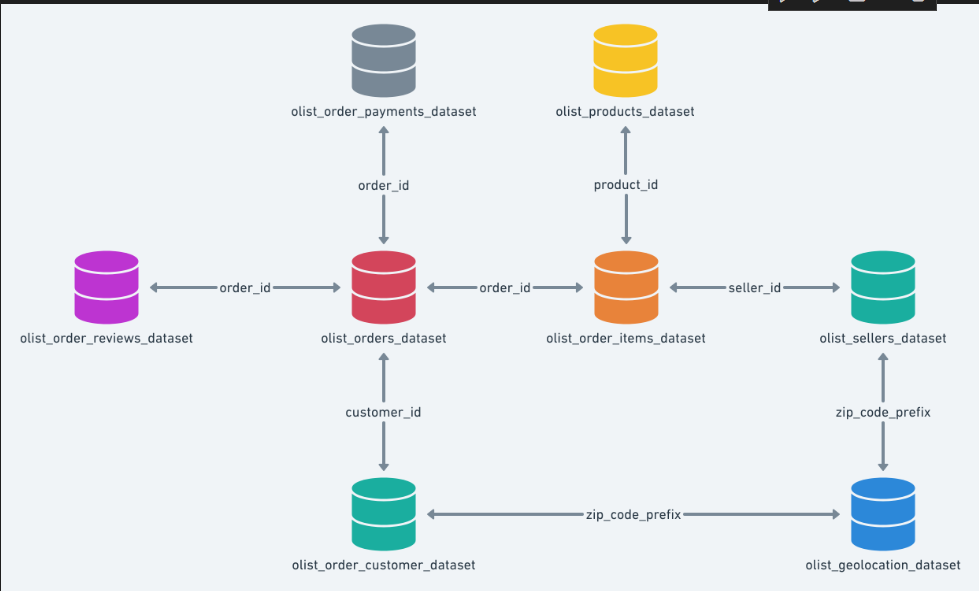


---
### *Questions addressed include:*
*1.Can we build predictive models to classify review sentiment and identify high-value customer segments?*

*2.What actionable business insights can be visualized through dashboards for stakeholders?*
## *Project Folder Structure*

```
DataMining_GroupProject_Group8/
├── data/
│   ├── raw/                ← Place your original CSV file here
│   ├── transformed/        ← Cleaned dataset goes here
│   └── final/              ← Dataset used for mining/dashboards
├── notebooks/
│   ├── 1_extract_transform.ipynb
│   ├── 2_exploratory_analysis.ipynb
│   ├── 3_data_mining.ipynb
│   └── 4_insights_dashboard.ipynb
├── report/
│   ├── executive_summary.pdf
│   └── presentation.pptx
├── requirements.txt
├── .gitignore
└── README.md
```


# *`Week-by-Week Progress`*
# *Week 1 & 2 – Kickoff & Dataset Selection :Mohamed Mohamed:1_extract_transform.ipynb*
### *I. Import Required Libraries*

*Essential Python libraries such as `pandas`, `numpy`, and `scikit-learn` are imported for data manipulation, cleaning, and feature engineering.*


### *Define Data Paths*

*A raw data path is set using a relative directory reference to organize the ETL structure and simplify file access.*

```python
RAW_PATH = "../data/raw"
```

# *I. Extract*


*All CSV files in the raw data directory are located using `glob`, loaded into individual pandas DataFrames, and stored in a dictionary for structured access.*

```python
csv_files = glob(os.path.join(RAW_PATH, "*.csv"))
datasets = {}
for file in csv_files:
    base = os.path.basename(file).replace("olist_", "").replace(".csv", "")
    datasets[base] = pd.read_csv(file)
```


### *Preview Datasets*

*Each dataset is previewed by printing its name, shape (rows × columns), and the first few rows to understand its contents and schema.*

---

### *Inspect Data Structure*

*The `.info()` method is used on each DataFrame to examine data types, null values, and column structure for initial profiling.*
```python
for name, df in datasets.items():
    print(f"\n--- Structure of Dataset: {name.upper()} ---\n")
    df.info()
    print("\n" + "-" * 80)
```

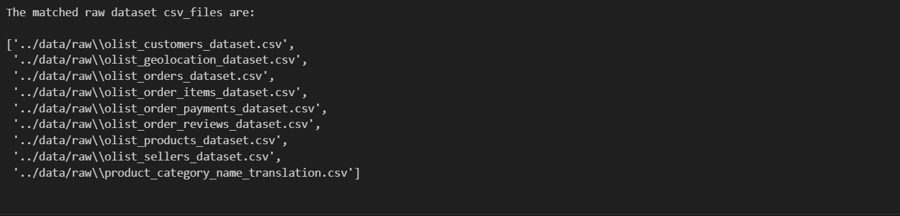

# *II.Transformation*
### *Data Cleaning & Transformation (Wrangling)*

*A `wrangle()` function is created to standardize and clean all datasets. This function performs the following operations:*

* *Column names are standardized to lowercase with underscores.*
* *Duplicate rows are removed.*
* *Columns with more than 50% missing values are dropped (exceptions apply).*
* *All date columns are parsed into datetime format.*
* *Whitespace is stripped from string-based fields.*
* *Low-cardinality object columns are converted to categorical types.*
* *Missing values are imputed: numeric columns with mean, and categorical/object columns with a constant placeholder.*
* *Columns relevant to customer and product categories are explicitly converted to categorical type.*

---
```python
def wrangle(df):
    df.columns = df.columns.str.lower().str.replace(" ", "_")
    df = df.drop_duplicates()
    exceptions = ['review_comment_title', 'review_comment_message''product_category_name']
    df = df.loc[:, (df.isnull().mean() < 0.5) | df.columns.isin(exceptions)]
    drop_cols = [
        "product_name_lenght", "product_description_lenght", "product_photos_qty",
        "payment_sequential", "review_id"
    ]
    df = df.drop(columns=[col for col in drop_cols if col in df.columns])
    date_cols = [col for col in df.columns if "date" in col or "timestamp" in col]
    for col in date_cols:
        df[col] = pd.to_datetime(df[col], errors="coerce")
    obj_cols = df.select_dtypes(include="object").columns
    df[obj_cols] = df[obj_cols].apply(lambda col: col.str.strip())
    cols_to_check = [
        'order_status', 'customer_city', 'customer_state',
        'product_category_name', 'seller_city', 'seller_state',
        'product_category_name_english'
    ]
    object_cols = df.select_dtypes(include="object").columns¬¬
    for col in cols_to_check:
        if col in object_cols:
            unique_vals = df[col].nunique()
            ratio = unique_vals / len(df)
            if ratio <= 0.05:
                df[col] = df[col].astype("category")
    numeric_cols = df.select_dtypes(include=["number"]).columns
    if len(numeric_cols) > 0:
        num_imputer = SimpleImputer(strategy="mean")
                df[numeric_cols] = num_imputer.fit_transform(df[numeric_cols])
    cat_object_cols = df.select_dtypes(include="object").columns
    if len(cat_object_cols) > 0:
        obj_imputer = SimpleImputer(strategy="constant", fill_value="unknown")
        df[cat_object_cols] = obj_imputer.fit_transform(df[cat_object_cols])
    for col in cols_to_check:
        if col in df.columns:
            df[col] = df[col].astype("category")
    return df
```


### *Apply Cleaning Function to All Datasets*

*The `wrangle()` function is applied to each DataFrame in the dataset collection to create a uniformly cleaned dataset collection.*

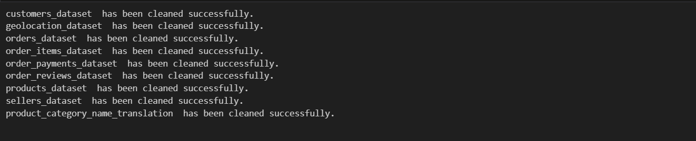
---

### *Merge Cleaned Datasets*

*The cleaned datasets are sequentially merged into a unified dataset (`olist_full_data`) using appropriate foreign key relationships:*

* *Orders are merged with customers, items, payments, reviews, products, sellers, category translations, and geolocation data.*
* *The final DataFrame contains an enriched view of each transaction across time, geography, customer behavior, and product attributes.*


```python
olist_full_data = cleaned_datasets["orders_dataset"]
olist_full_data = olist_full_data.merge(cleaned_datasets["customers_dataset"], on="customer_id", how="left")
olist_full_data = olist_full_data.merge(cleaned_datasets["order_items_dataset"], on="order_id", how="left")
olist_full_data = olist_full_data.merge(cleaned_datasets["order_payments_dataset"], on="order_id", how="left")
olist_full_data = olist_full_data.merge(cleaned_datasets["order_reviews_dataset"], on="order_id", how="left")
olist_full_data = olist_full_data.merge(cleaned_datasets["products_dataset"], on="product_id", how="left")
olist_full_data = olist_full_data.merge(cleaned_datasets["sellers_dataset"], on="seller_id", how="left")
olist_full_data = olist_full_data.merge(cleaned_datasets["product_category_name_translation"], on="product_category_name", how="left")
olist_full_data = olist_full_data.merge(
    cleaned_datasets["geolocation_dataset"].drop_duplicates("geolocation_zip_code_prefix"),
    left_on="customer_zip_code_prefix",
    right_on="geolocation_zip_code_prefix",
    how="left"
)
```
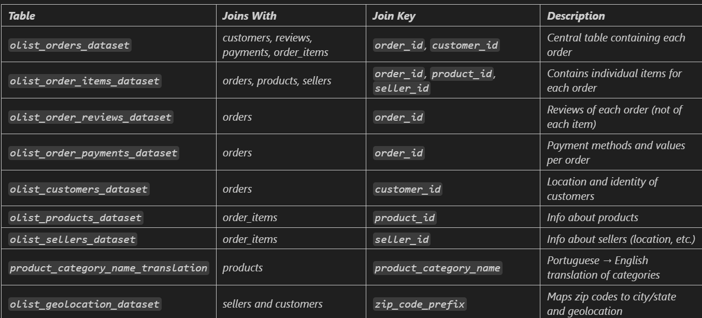
---

### *Final Data Cleaning*

*Post-merge cleanup includes logical imputation for key date fields, conversion of ZIP codes and order item IDs to string, and removal of rows with critical missing values.*

---

### *Feature Engineering*

*New features are created to enhance analytical capability:*

* *Financial metrics:* `profit_margin`, `freight_ratio`
* *Logistics metrics:* `estimated_delay`, `order_processing_time`
* *Customer segmentation metrics (RFM):* `recency_days`, `purchase_frequency`, `monetary_value`
* *Product-level metrics:* `product_volume_cm3`, `product_density`, `category_review_score`
* *Categorical flags:* `is_late`, `high_freight_flag`

---

### *Save Transformed Data*

*The final cleaned and enriched dataset is saved in both `.csv` and `.parquet` formats to support downstream modeling and dashboarding.*


---


# *III.Loading*


 *Step 1: Read the Transformed Dataset*

 *Step 2: Load transformed_dataset  as Parquet*

 

---
*step-3 Preview the full_data results*

#### *ETL Summary*
*The raw dataset is loaded and examined for structure and quality. Data types are corrected (e.g., date fields), missing values are handled, and new calculated columns are created (such as profit margin). Cleaned and structured data is then saved for further analysis.*

# *Week 3 – Exploratory & Statistical Analysis:Halima Mohammed:2_exploratory_analysis.ipynb*

---

### *Data Loading & Overview:*

*Basic methods for loading and previewing data:*

```python
df = pd.read_csv('your_data.csv')
df.info()
```
---

###  *Summary Statistics:*

*Generates descriptive statistics for numerical features:*

```python

numerical_df = df.select_dtypes(include=[np.number])
print(numerical_df.describe().round(2))
```
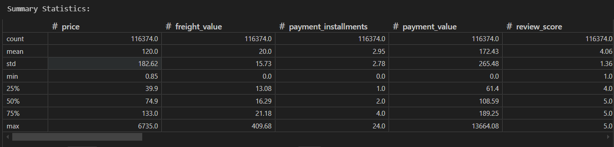
---

### *Univariate Analysis:*

*Visualizes distributions using `histplot`, `boxplot`, `countplot` from Seaborn.*

*Highlights skewed distributions and common value ranges.*

```python
sns.histplot(data=df, x='price', bins=50, kde=True)
```
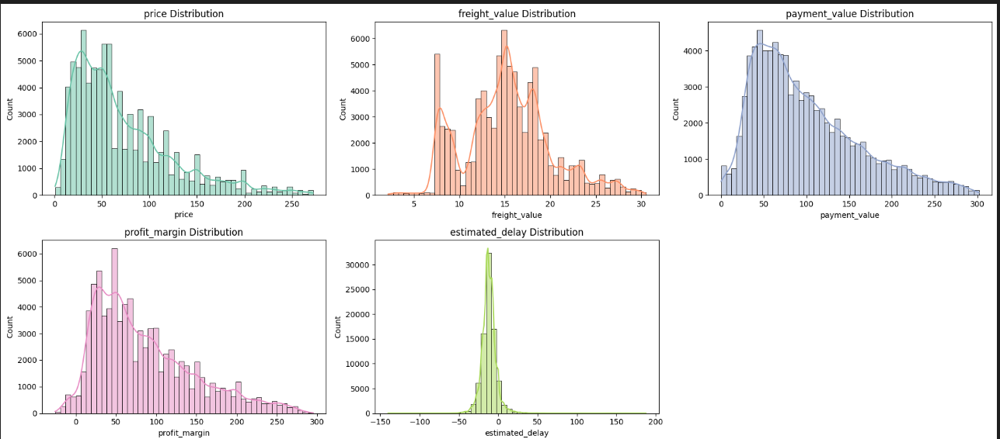
---

### *Bivariate Analysis:*

*Correlation analysis & visualizations:*

```python
corr_matrix = df.corr()
sns.heatmap(corr_matrix, annot=True, cmap='coolwarm')
```
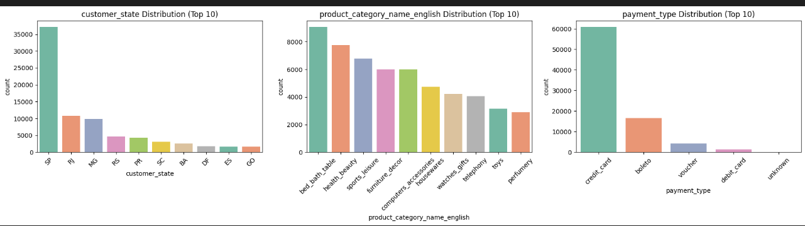
*Focuses on:*

* *Relationships between `payment_value`, `price`, `profitability`*
* *Group differences across product categories and regions*

---

### *Customer Behavior: RFM Segmentation*

*Analyzes Recency, Frequency, Monetary value:*

```python
sns.scatterplot(data=df, x='recency_days', y='monetary_value', size='purchase_frequency')
```

*Identifies loyal vs one-time customers and high-value segments.*

---

# *Week 4 – Data Minning: Snit_Teshome 3_data_mining.ipynb*
###  *Machine Learning & NLP: Clustering, Sentiment & Text Classification*
---

#### *Data Loading & Preparation*

*Loaded e-commerce review, order, and product data.*
*Merged datasets to create a unified DataFrame for analysis.*

```python
df_reviews = pd.read_csv('.../olist_order_reviews_dataset.csv')
df_items = pd.read_csv('.../olist_order_items_dataset.csv')
df_products = pd.read_csv('.../olist_products_dataset.csv')
```

---

### *Clustering (Unsupervised Learning)*

*Selected relevant numerical features (e.g., monetary value, purchase frequency, review score).*
*Scaled features and applied K-Means clustering.*
*Used the Elbow Method to determine optimal clusters (k=6).*
*Profiled clusters to understand customer segments.*

```python
features_to_cluster = ['monetary_value', 'purchase_frequency', 'recency_days', 'review_score', 'profit_margin']
scaler = StandardScaler()
scaled_data = scaler.fit_transform(df[features_to_cluster])
kmeans = KMeans(n_clusters=6, random_state=42)
df['cluster'] = kmeans.fit_predict(scaled_data)
```

---
### *Natural Language Processing (NLP) & Sentiment Analysis*

*Cleaned and preprocessed review text (removed duplicates, stopwords, punctuation).*
*Generated word clouds to visualize frequent terms in reviews.*
*Used VADER sentiment analysis to classify reviews as Positive, Neutral, or Negative.*
*Visualized sentiment distribution.*

```python
def clean_and_tokenize(text): ...
wordcloud = WordCloud(...).generate(' '.join(df['review_comment_message_clean'].dropna()))
analyzer = SentimentIntensityAnalyzer()
def classify_sentiment(text): ...
df['sentiment'] = df['review_comment_message_clean'].map(classify_sentiment)
```

---
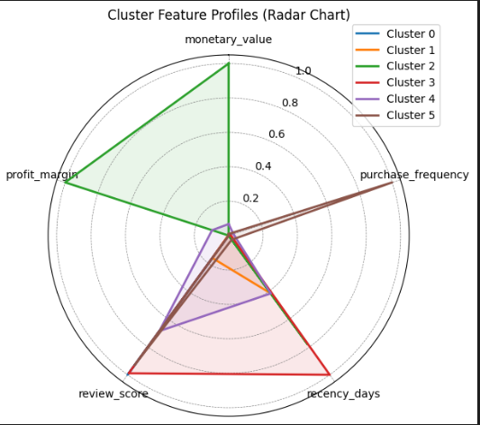
### *Text Classification (Supervised Learning)*

*Defined features (review text) and target (sentiment label).*
*Split data into training and test sets.*
*Encoded sentiment labels and vectorized text using TF-IDF.*
*Trained a Logistic Regression model to predict sentiment.*
*Evaluated model with accuracy, confusion matrix, and classification report.*
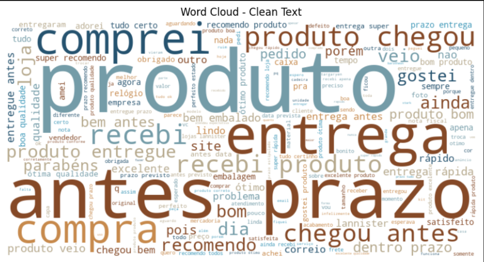

```python
X = df['review_comment_message']
y = df['sentiment']
X_train, X_test, y_train, y_test = train_test_split(X, y, ...)
vectorizer = TfidfVectorizer(max_features=5000)
X_train_tfidf = vectorizer.fit_transform(X_train)
X_test_tfidf = vectorizer.transform(X_test)
model = LogisticRegression(...)
model.fit(X_train_tfidf, y_train)
y_pred = model.predict(X_test_tfidf)
print(classification_report(y_test, y_pred))
```
## *Classification Report*
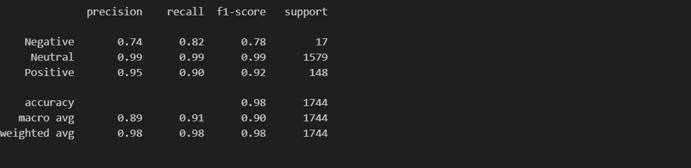
---


## *Tools & Technologies*

- *Python* (Pandas, NumPy, Matplotlib, Seaborn, Scikit-learn, NLTK, spaCy, Transformers)
- *Jupyter Notebook*
- *Git & GitHub* for version control and collaboration
- *Plotly*, *Seaborn*, and *Power BI* for data visualization

# *Week 5: – Lesala Phillip Monaheng:4_insights_dashboard.ipynb*

*Created an interactive dashboard to visualize key insights from the analysis.*

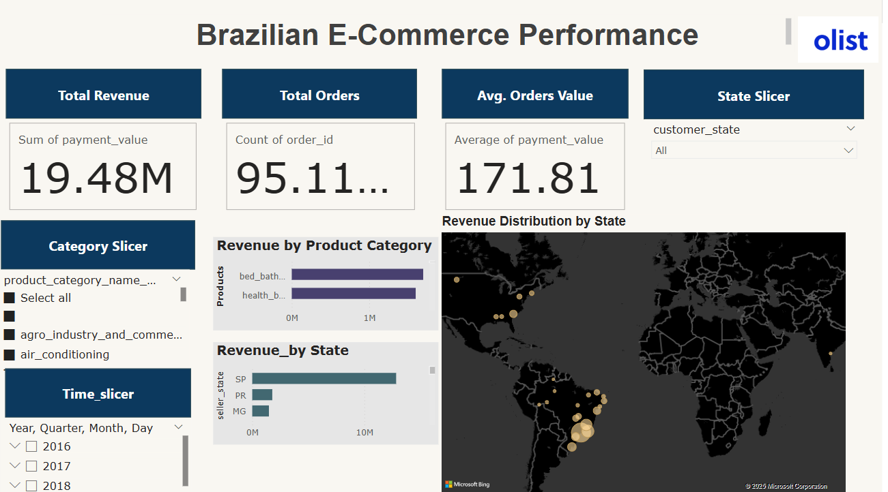

---

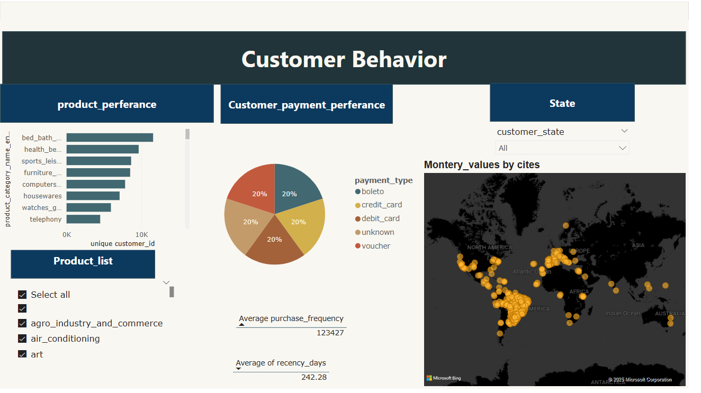


## *How to Run*04_insights_dashboard

*Clone the repository Full Workflow (Cloning → Making Changes → Committing → Pushing)*

```bash
git clone https://github.com/SnitTeshome/DSA2040A_DataMining_Group-8_Snit_552___Mohamed_006___Halima_315___Lesala_218.git
cd DSA2040A_DataMining_Group-8_Snit_552___Mohamed_006___Halima_315___Lesala_218
```
``` bash
git status
git add .
git commit -m "Your commit message"
git push origin main
```

## *Data Source*

*Dataset used:* [**Olist E-commerce Dataset**](https://www.kaggle.com/code/rasikagurav/brazilian-e-commerce-eda-nlp)  


---

### *License*

*This project is licensed under the* [MIT License](https://github.com/SnitTeshome/DSA2040A_DataMining_Group-8_Snit_552___Mohamed_006___Halima_315___Lesala_218/blob/main/LICENSE).
*You are free to use, copy, modify, and distribute this software, provided the original license is included.*

---


